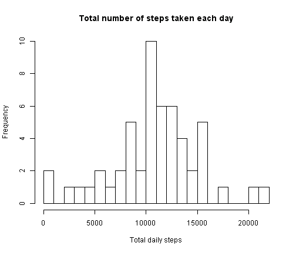
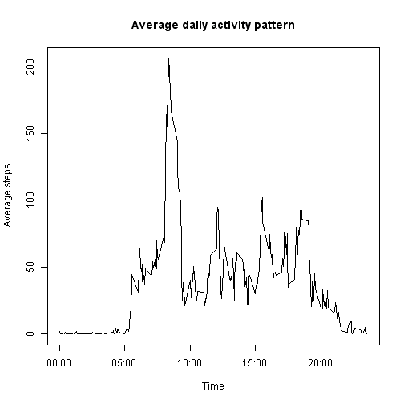
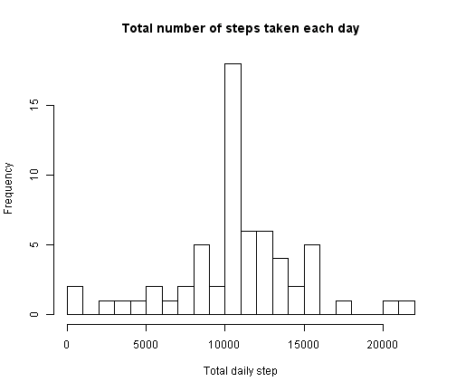
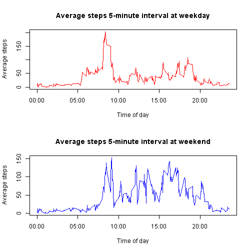

Peer Assessment 1 of Reproducible Research
========================================================

## Introduction

It is now possible to collect a large amount of data about personal movement using activity monitoring devices such as a Fitbit, Nike Fuelband, or Jawbone Up. These type of devices are part of the "quantified self" movement - a group of enthusiasts who take measurements about themselves regularly to improve their health, to find patterns in their behavior, or because they are tech geeks. But these data remain under-utilized both because the raw data are hard to obtain and there is a lack of statistical methods and software for processing and interpreting the data.

This assignment makes use of data from a personal activity monitoring device. This device collects data at 5 minute intervals through out the day. The data consists of two months of data from an anonymous individual collected during the months of October and November, 2012 and include the number of steps taken in 5 minute intervals each day.

## Data

The data for this assignment can be downloaded from the course web site:

- Dataset: Activity monitoring data

The variables included in this dataset are:

- steps: Number of steps taking in a 5-minute interval (missing values are coded as NA)

- date: The date on which the measurement was taken in YYYY-MM-DD format

- interval: Identifier for the 5-minute interval in which measurement was taken

The dataset is stored in a comma-separated-value (CSV) file and there are a total of 17,568 observations in this dataset.

## Assignment Report

### Loading and preprocessing the data

```r
# set work directory to the local folder containg the data
rm(list = ls())
setwd("C:/Jing/ProgramCode/DataScience/C5_Reproducible_Research")
getwd()
```

```
## [1] "C:/Jing/ProgramCode/DataScience/C5_Reproducible_Research"
```

```r
# load activity data 
data <- read.csv("./data/repdata-data-activity/activity.csv")
names(data)
```

```
## [1] "steps"    "date"     "interval"
```

### What is mean total number of steps taken per day?

For this part of the assignment, the missing values in the dataset are ignored.

1. Make a histogram of the total number of steps taken each day

2. Calculate and report the mean and median total number of steps taken per day


```r
steps_per_day <- tapply(data$steps, data$date, sum)
hist(steps_per_day, xlab = "Total daily steps", breaks = 30, 
    main = "Total number of steps taken each day")
```

 


```r
steps_mean <- mean(steps_per_day, na.rm = TRUE)
steps_median <- median(steps_per_day, na.rm = TRUE)
```

The mean and median total number of steps taken perday are 1.0766 &times; 10<sup>4</sup> and 10765 respectively. 

### What is the average daily activity pattern?
1. Make a time series plot (i.e. type = "l") of the 5-minute interval (x-axis) and the average number of steps taken, averaged across all days (y-axis)

2. Which 5-minute interval, on average across all the days in the dataset, contains the maximum number of steps?


```r
data$interval <- as.factor(as.character(data$interval))
intervals.steps <- tapply(data$steps,data$interval, mean, na.rm = TRUE)
intervals <- as.numeric(levels(data$interval))
steps_per_intervals <- data.frame(intervals, intervals.steps)
steps_per_intervals <- steps_per_intervals[order(steps_per_intervals$intervals),]

labels <- c("00:00", "05:00", "10:00", "15:00", "20:00")
labels.at <- seq(0, 2000, 500)
plot(steps_per_intervals$intervals, steps_per_intervals$intervals.steps, type = "l", 
     xaxt = "n",xlab = "Time",ylab = "Average steps",
     main = "Average daily activity pattern")
axis(side = 1, at = labels.at, labels = labels)
```

 

```r
steps_per_intervals_sorted <- steps_per_intervals[order(steps_per_intervals$intervals.steps, decreasing = TRUE),]
head(steps_per_intervals_sorted)
```

```
##     intervals intervals.steps
## 835       835           206.2
## 840       840           195.9
## 850       850           183.4
## 845       845           179.6
## 830       830           177.3
## 820       820           171.2
```

```r
# Which 5-minute interval, on average across all the days in the dataset, contains the maximum number of steps?
interval_with_max <- steps_per_intervals_sorted$intervals[1[1]]
```

835 contains the maximum number of steps, on avergae across all the days in the dataset.


### Imputing missing values

Note that there are a number of days/intervals where there are missing values (coded as NA). The presence of missing days may introduce bias into some calculations or summaries of the data.

1. Calculate and report the total number of missing values in the dataset (i.e. the total number of rows with NAs)


```r
dim(data[is.na(data$steps), ])[1]
```

```
## [1] 2304
```

2. Filling in all of the missing values in the dataset, using the mean for that 5-minute interval.


```r
steps <- vector()
for (i in 1:dim(data)[1]) {
    if (is.na(data$steps[i])) {
        steps <- c(steps, steps_per_intervals$intervals.steps[intervals == data$interval[i]])
    } else {
        steps <- c(steps, data$steps[i])
    }
}
```

3. Create a new dataset that is equal to the original dataset but with the missing data filled in.


```r
data_no_missing <- data.frame(steps = steps, date = data$date, 
    interval = data$interval)
head(data_no_missing)
```

```
##     steps       date interval
## 1  1.7170 2012-10-01        0
## 2 99.4528 2012-10-01        5
## 3  0.3396 2012-10-01       10
## 4 31.4906 2012-10-01       15
## 5 25.5472 2012-10-01       20
## 6 74.5472 2012-10-01       25
```

4. Make a histogram of the total number of steps taken each day and Calculate and report the mean and median total number of steps taken per day. Do these values differ from the estimates from the first part of the assignment? What is the impact of imputing missing data on the estimates of the total daily number of steps?


```r
hist(tapply(data_no_missing$steps, data_no_missing$date, sum), xlab = "Total daily step", breaks = 30, 
     main = "Total number of steps taken each day")
```

 

The mean and median total number of steps taken perday are respectively: 


```r
mean(tapply(data_no_missing$steps, data_no_missing$date, sum), na.rm = TRUE)
```

```
## [1] 10766
```

```r
median(tapply(data_no_missing$steps, data_no_missing$date, sum), na.rm = TRUE)
```

```
## [1] 10766
```

These two values are the same as the the two values of differ from the estimates from the first of the assignment, because we filling in all of the missing values in the dataset, using the mean for that 5-minute interval.

### Are there differences in activity patterns between weekdays and weekends?

Use the dataset with the filled-in missing values for this part.

1. Create a new factor variable in the dataset with two levels - "weekday" and "weekend" indicating whether a given date is a weekday or weekend day.


```r
data_no_missing$day.type <- c("weekend", "weekday", "weekday", 
    "weekday", "weekday", "weekday", "weekend")[as.POSIXlt(data_no_missing$date)$wday +1]
data_no_missing$day.type <- as.factor(data_no_missing$day.type)

weekday <- data_no_missing[data_no_missing$day.type == "weekday", ]
weekend <- data_no_missing[data_no_missing$day.type == "weekend", ]
weekday.means <- as.numeric(tapply(weekday$steps, weekday$interval, mean))
weekend.means <- as.numeric(tapply(weekend$steps, weekend$interval, mean))

intervals.day.type <- data.frame(intervals = as.numeric(levels(data$interval)), 
    weekday.means, weekend.means)
intervals.day.type <- intervals.day.type[order(intervals.day.type$intervals), ]
```
2. Make a panel plot containing a time series plot (i.e. type = "l") of the 5-minute interval (x-axis) and the average number of steps taken, averaged across all weekday days or weekend days (y-axis). The plot should look something like the following, which was creating using simulated data:

```r
par <- par(mfrow = c(2, 1))
plot(intervals.day.type$intervals, intervals.day.type$weekday.means, type = "l", 
    col = "red", ylab = "Average steps", xlab = "Time of day", main = "Average steps 5-minute interval at weekday", 
    xaxt = "n")
axis(side = 1, at = labels.at, labels = labels)
plot(intervals.day.type$intervals, intervals.day.type$weekend.means, type = "l", 
    col = "blue", ylab = "Average steps", xlab = "Time of day", main = "Average steps 5-minute interval at weekend", 
    xaxt = "n")
axis(side = 1, at = labels.at, labels = labels)
```

 
